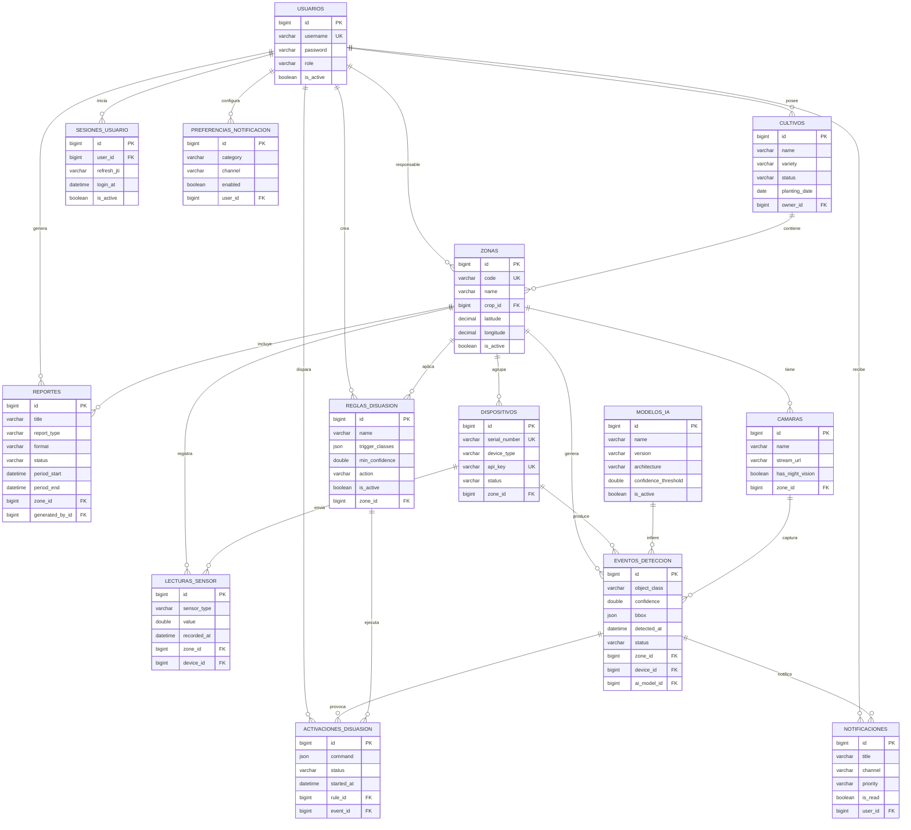

# Diagrama entidad-relación SIAAC

```mermaid
erDiagram
    USUARIOS ||--o{ CULTIVOS : "posee"
    USUARIOS ||--o{ ZONAS : "responsable"
    USUARIOS ||--o{ SESIONES_USUARIO : "inicia"
    USUARIOS ||--o{ NOTIFICACIONES : "recibe"
    USUARIOS ||--o{ PREFERENCIAS_NOTIFICACION : "configura"
    USUARIOS ||--o{ REPORTES : "genera"
    USUARIOS ||--o{ REGLAS_DISUASION : "crea"
    USUARIOS ||--o{ ACTIVACIONES_DISUASION : "dispara"

    CULTIVOS ||--o{ ZONAS : "contiene"
    ZONAS ||--o{ DISPOSITIVOS : "agrupa"
    ZONAS ||--o{ CAMARAS : "tiene"
    ZONAS ||--o{ LECTURAS_SENSOR : "registra"
    ZONAS ||--o{ EVENTOS_DETECCION : "genera"
    ZONAS ||--o{ REGLAS_DISUASION : "aplica"
    ZONAS ||--o{ REPORTES : "incluye"

    DISPOSITIVOS ||--o{ LECTURAS_SENSOR : "envia"
    DISPOSITIVOS ||--o{ EVENTOS_DETECCION : "produce"
    MODELOS_IA ||--o{ EVENTOS_DETECCION : "infiere"
    CAMARAS ||--o{ EVENTOS_DETECCION : "captura"

    EVENTOS_DETECCION ||--o{ ACTIVACIONES_DISUASION : "provoca"
    EVENTOS_DETECCION ||--o{ NOTIFICACIONES : "notifica"
    REGLAS_DISUASION ||--o{ ACTIVACIONES_DISUASION : "ejecuta"

    USUARIOS {
        bigint id PK
        varchar username UK
        varchar password
        varchar role
        boolean is_active
    }
    SESIONES_USUARIO {
        bigint id PK
        bigint user_id FK
        varchar refresh_jti
        datetime login_at
        boolean is_active
    }
    CULTIVOS {
        bigint id PK
        varchar name
        varchar variety
        varchar status
        date planting_date
        bigint owner_id FK
    }
    ZONAS {
        bigint id PK
        varchar code UK
        varchar name
        bigint crop_id FK
        decimal latitude
        decimal longitude
        boolean is_active
    }
    DISPOSITIVOS {
        bigint id PK
        varchar serial_number UK
        varchar device_type
        varchar api_key UK
        varchar status
        bigint zone_id FK
    }
    CAMARAS {
        bigint id PK
        varchar name
        varchar stream_url
        boolean has_night_vision
        bigint zone_id FK
    }
    LECTURAS_SENSOR {
        bigint id PK
        varchar sensor_type
        double value
        datetime recorded_at
        bigint zone_id FK
        bigint device_id FK
    }
    MODELOS_IA {
        bigint id PK
        varchar name
        varchar version
        varchar architecture
        double confidence_threshold
        boolean is_active
    }
    EVENTOS_DETECCION {
        bigint id PK
        varchar object_class
        double confidence
        json bbox
        datetime detected_at
        varchar status
        bigint zone_id FK
        bigint device_id FK
        bigint ai_model_id FK
    }
    REGLAS_DISUASION {
        bigint id PK
        varchar name
        json trigger_classes
        double min_confidence
        varchar action
        boolean is_active
        bigint zone_id FK
    }
    ACTIVACIONES_DISUASION {
        bigint id PK
        json command
        varchar status
        datetime started_at
        bigint rule_id FK
        bigint event_id FK
    }
    NOTIFICACIONES {
        bigint id PK
        varchar title
        varchar channel
        varchar priority
        boolean is_read
        bigint user_id FK
    }
    PREFERENCIAS_NOTIFICACION {
        bigint id PK
        varchar category
        varchar channel
        boolean enabled
        bigint user_id FK
    }
    REPORTES {
        bigint id PK
        varchar title
        varchar report_type
        varchar format
        varchar status
        datetime period_start
        datetime period_end
        bigint zone_id FK
        bigint generated_by_id FK
    }
```
